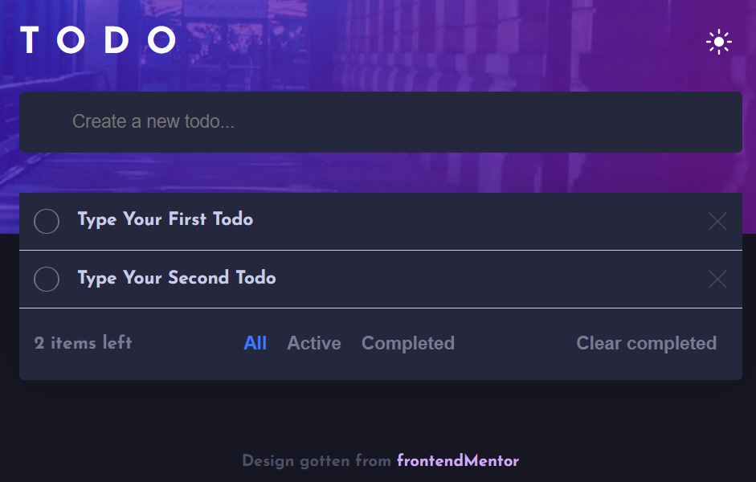

# User Onboarding Tour with Driver.js

This repository contains the starter code for an [OpenReplay]("https://www.openreplay.com/) article on how to create a user onboarding tour with [Driver.js](http://driverjs.com/).

## Getting Started

Follow these instructions to get the project up and running on your local machine for development purpose.

### Prerequisites

Make sure you have the following installed:

- [Node.js](https://nodejs.org/en/)
- [npm](https://www.npmjs.com/get-npm)
- [Git]("https://git-scm.com/")

### Installing

Clone the repository:

```sh
git clone https://github.com/ezeaniiandrew/driverjs-demo.git
```

Navigate to the project directory:

```sh
cd driverjs-demo
```

Install the dependencies:

```sh
npm install
```

### Running the Development Server

Start the development server:

```sh
npm run dev
```

With the development server running, you should see this image in your browser:



## Credits

The design for this project was gotten from [FrontendMentor]("https://www.frontendmentor.io/challenges/todo-app-Su1_KokOW").
